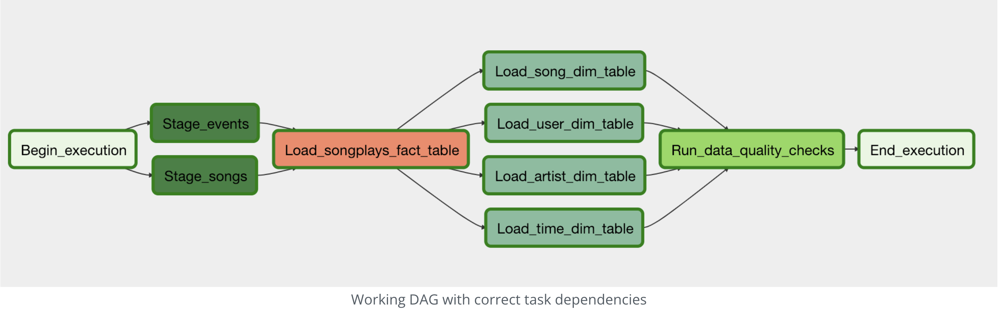

# Cluster Warehouse with Apache Airflow

<div align="justify">
This repository is a use case for developing a Redshift serverless cluster data warehouse (DWH) in Amazon Web Service (AWS).
The goal of the repository is to automate and monitor an ETL process with **Apache Airflow**. The use case is based on an
imaginary music streaming startup, Sparkify, that has grown their user base and song database, and they 
 expect to create high grade data pipelines that are dynamic and 
built from reusable tasks, can be monitored, and allow easy backfills. run tests against their datasets after the ETL 
steps have been executed to catch any discrepancies in the datasets. Their data resides in S3, in a directory of 
JSON logs on user activity on the app, as well as a directory with JSON metadata on the songs in their app.


In this repository we run a basic Apache Airflow project with tasks such as staging the data, filling the data warehouse,
and running checks on the data as the final step. 


The project is based on the project: Automating Data Pipelines in the Data Engineer course, Udacity.


Prerequisites:
* Python mid level
* AWS environment: Create an account, IAM, s3 and EC2 management basics. 
* Confortable with SQL operations for database creation. 
* Basic data modeling, 3rd Normal Form, denormaliztion, etc... will be a plus


## Project Datasets


We work with 3 datasets that reside in S3. Here are the S3 links for each:


* Song data: `s3://udacity-dend/song_data`
* Log data: `s3://udacity-dend/log_data`
* This third file `s3://udacity-dend/log_json_path.json` contains the meta information that is required by AWS to
correctly load `s3://udacity-dend/log_data`

The first dataset is a subset of real data from the [Million Song Dataset](http://millionsongdataset.com/). Each file is in JSON format and contains 
metadata about a song and the artist of that song. The files are partitioned by the first three letters of each song's 
track ID. For example, here are file paths to two files in this dataset.

The second dataset consists of log files in JSON format generated by this [event simulator](https://github.com/Interana/eventsim) based on the songs in the 
dataset above. These simulate app activity logs from an imaginary music streaming app based on configuration settings.

For loading JSON files to Redshift check [here](https://hevodata.com/learn/json-to-redshift/)

**Tip: You will want to copy the data to your own bucket.**


### Copy S3 Data

The data is stored in Udacity's S3 bucket. This bucket is in the US West AWS Region. 
You can copy the data to your own bucket, so Redshift can access the bucket.

create your own S3 bucket using the AWS Cloudshell (this is just an example - buckets need to be unique across all AWS accounts): 
`aws s3 mb s3://your-bucket-example/`

Copy the data from the udacity bucket to the home cloudshell directory:
```
aws s3 cp s3://udacity-dend/log-data/ ~/log-data/ --recursive
aws s3 cp s3://udacity-dend/song-data/ ~/song-data/ --recursive
```
Copy the data from the home cloudshell directory to your own bucket -- this is only an example: 

```
aws s3 cp ~/log-data/ s3://your-bucket-example/log-data/ --recursive
aws s3 cp ~/song-data/ s3://your-bucket-example/song-data/ --recursive
aws s3 cp s3://udacity-dend/log_json_path.json s3://your-bucket-example/log-data-path/ 
```
**If it takes too much time for the load, you can stop it at any point. 
For test purpose, only a fraction of the data is necessary**

## ETL pipeline design

For this exercise the ETL pipeline design is not the main focus. For that, the repository contain all the necessary resources
for the ETL pipeline design. The project is based on the Apache Airflow implementation orchestrating the ETL pipeline. 
To learn more about the ETL implementation please refer to my other repository [here]().


## Redshift serverless cluster


To work with this project you will need to have an account in AWS. A free account will do. We have chosen the option of
the Redshift serverless cluster to manage and analyze the data. Amazon Redshift Serverless automatically provisions 
data warehouse capacity and intelligently scales the underlying resources. Amazon Redshift Serverless adjusts capacity 
in seconds to deliver consistently high performance and simplified operations for even the most demanding and volatile
workloads. To connect Airflow with the cluster, we will need 2 things. First AWS user credentials, and a Redshift
serverless cluster and its endpoint. 

For that the next steps are require:
1. Create a IAM user with the necessary policies:
   * AdministratorAccess
   * AmazonRedshiftFullAccess
   * AmazonS3FullAccess


2. Once the user is created, grant him with the access key and download the key and the secret password of the key. 
3. You also will need to create a role to admin the cluster. 
 
3. Go to Redshift interface and find create new Redshift serverless cluster with the role and user previously created.
4. Remember in the set-up of the cluster select "Turn on enhanced VPC routing" and "Turn on Publicly accessible". 
Once the cluster is created, go inside the cluster and in actions, clik on "Modify public accessibility" and click on 
"Enable". 
5. Go back to the Redshift Workgroup and copy the endpoint. Store this locally as we will need this while configuring 
Airflow. Example: `default.365818xxxxxx.us-east-1.redshift-serverless.amazonaws.com:5439/dev`

If you are not familiar with the AWS and Redshift role creation please refer to: [Redshift tutorial](https://docs.aws.amazon.com/redshift/latest/dg/tutorials-redshift.html)


To know more about Redshift serverless refer to: [Redshift serverless](https://docs.aws.amazon.com/redshift/latest/mgmt/serverless-whatis.html)

## Airflow connections

In folder `plugins/connector` you can find the `set_connecions.sh` file  with all the necessary commands 
to create the connections from Airflow to the cluster. Replace the necesary fields with the information 
you gather in the previous step (AWS credentials, Redshift endpoint and s3 buckets variables).

If you are working with Docker, to run the set_connection.sh script, you will need to run it inside
a container. For that, first you need to find the containers ids:
```
docker ps 
```
That will give you the list of ids. Select the one with the webserver and past it here to run it:

```
docker exec -it <webservice-container-id> bash <your-paht>/set_connections.sh
```

**DO NOT** share your private information with anyone. In case you update the project, remember to delete sensitive information 
from your AWS account.

## Docker set-up

The project is running with a Docker installation for Apache Airflow. 
To know more about the different installations please follow this YouTube [tutorial](https://www.youtube.com/watch?v=K9AnJ9_ZAXE).

## Project execution


To complete the project we will build a DAG with different tasks for the Airflow orchestration. 
All the operators and task instances will run SQL statements against the Redshift database. The queries
are provided in the repository. 

### Stage task
The stage task is expected to be able to load any JSON formatted files from S3 to Amazon Redshift.
The task creates and runs a SQL COPY statement based on the parameters provided. The task's 
parameters specify where in S3 the file is loaded and what is the target table. 

### Fact and dimensions tasks
With dimension and fact tasks, we utilize the provided SQL helper class to run data
transformations. Most of the logic is within the SQL transformations and the task is 
expected to take as input a SQL statement and target database on which to run the query 
against. 

Dimension loads are done with the truncate-insert pattern where the target table 
is emptied before the load. Thus, we also have a parameter that allows switching 
between insert modes when loading dimensions. Fact tables are usually so massive that they 
should only allow to append type functionality.

### Data quality task 
Finally, the data quality operator, which is used to run checks on the 
data itself. The task's main functionality is to receive one or more SQL based test cases 
along with the expected results and execute the tests. For each the test, the test result and 
expected result needs to be checked and if there is no match, the operator should raise an 
exception and the task should retry and fail eventually.

For example one test could be a SQL statement that checks if certain column contains NULL 
values by counting all the rows that have NULL in the column. We do not want to have any NULLs 
so expected result would be 0 and the test would compare the SQL statement's 
outcome to the expected result.

</div>
